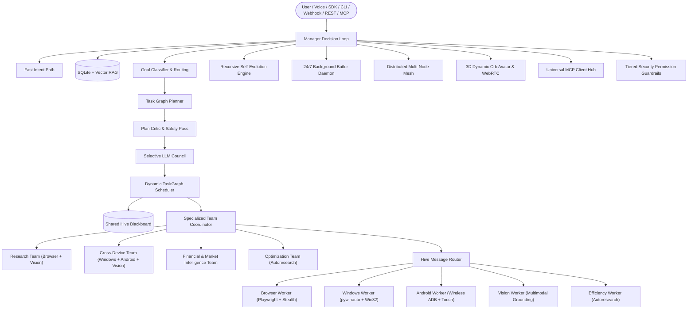

# 🤖 Mitchell — Autonomous Multi-Agent Hive & Task Orchestration Framework (v1.0.0 Golden Release)

<p align="center">
  
  
  
  
</p>

**Mitchell** is a self-hosted, self-evolving, cross-platform autonomous multi-agent framework. Built with Karpathy engineering rigor, it coordinates browser automation, native Windows UIA, wireless Android touch, multimodal vision, full-duplex voice streams, distributed mesh clusters, and 24/7 background daemons.

---

## 🌟 Master Architecture Overview



---

## 🚀 Quickstart & Universal Installation

### 1. Windows 1-Click Setup (PowerShell)
```powershell
powershell -ExecutionPolicy Bypass -File scripts\install.ps1
```

### 2. Linux / macOS / WSL2 1-Click Setup (Bash)
```bash
bash scripts/install.sh
```

### 3. Production Docker Compose Sandboxed Hive
```bash
docker compose up -d
```

---

## 📦 Python SDK Quickstart

Embed Mitchell directly into your Python scripts or web applications with 3 lines of code:

```python
import mitchell

# Connect to local hive or remote mesh node
hive = mitchell.connect()

# 1. Execute an autonomous multi-step goal
result = hive.do("Search the latest breakthroughs in quantum computing and summarize")
print(result)

# 2. Voice & Speech
hive.voice.speak("Task execution completed successfully.")

# 3. Visual On-Screen Guidance
hive.screen.highlight(x=350, y=200, width=150, height=40, label="Search Button")

# 4. Financial Analysis
market_report = hive.teams.get_team("finance_team")
```

---

## 💻 CLI Command Reference

| Command | Description |
| :--- | :--- |
| `mitchell do "<goal>"` | Execute an autonomous goal directly |
| `mitchell launch` | Start REST API, WebSocket Orb, and background daemons |
| `mitchell voice` | Start hands-free voice mode (*wake word: "hey mitchell"*) |
| `mitchell studio` | Launch real-time Visual Workflow Studio web UI (`http://127.0.0.1:8500`) |
| `mitchell avatar` | Launch 3D Dynamic Orb Avatar (`http://127.0.0.1:8550`) |
| `mitchell butler` | Run 24/7 background task queue worker |
| `mitchell schedule "<cron>" "<goal>"` | Schedule recurring autonomous routines (e.g. `0 8 * * *`) |
| `mitchell evolve` | Trigger recursive self-evolution and test verification |
| `mitchell mesh` | Manage and inspect distributed multi-node cluster |
| `mitchell plugin` | Discover and manage drop-in `.mitchell/plugins/` |
| `mitchell benchmark` | Run standardized multi-agent evaluation arena |
| `mitchell security` | Inspect permission tiers and SHA256 audit log integrity |
| `mitchell deploy` | Generate systemd service units and Caddy reverse proxy configs |

---

## 🧪 Comprehensive Verification

To run the complete 24-scenario automated test suite:

```bash
python -m pytest tests/test_full_system.py -v
```

---

## 📄 License

Mitchell is licensed under the **MIT License**.
