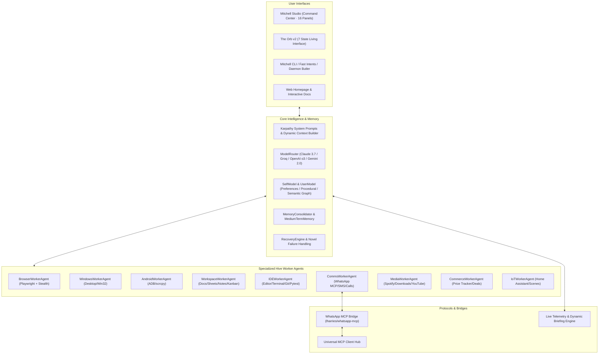

# 🤖 Mitchell AI — Autonomous Multi-Agent Hive & Living Operating System (2026 Peak)

<p align="center">
  
  
  
  
  
</p>

**Mitchell AI** is a self-hosted, self-extending, native-first personal AI operating system. Engineered with **Karpathy Principles of Rigor** (*Think Before Acting, Simplicity First, Surgical Changes, Goal-Driven Execution*), Mitchell seamlessly unifies your desktop, mobile, cloud models, native workspace, and home automation into one continuous machine.

---

## 🌟 Master Architecture



---

## ⚡ Key Capabilities (2026 Practical Maximum)

### 1. Mitchell Studio Command Center
- Full-screen dark glassmorphism dashboard with 16 panels:
  - **Live Chat** with streaming LLM response tokens and auto-fallback
  - **Native Workspace** (Docs, Spreadsheets, Linked Notes, Kanban Project Boards)
  - **Agentic IDE** with Monaco editor, syntax validation, diffs, and terminal execution
  - **WhatsApp MCP & Unified Comms** (WhatsApp, SMS, Email, Scheduled Messages)
  - **Media Center** (Spotify playback, IDM-style download manager, YouTube downloader)
  - **Commerce Hub** (Product comparison, price-drop alert tracker, coupon finder)
  - **Smart Home IoT** (Home Assistant integration, lights, climate, smart scenes)
  - **Memory Graph** (Episodic, Semantic Graph Triples, User Model Preferences)
  - **System Diagnostics & Telemetry**
- Launch instantly via: `python -m mitchell.cli studio` or `mitchell studio`

### 2. WhatsApp MCP Integration ([lharries/whatsapp-mcp](https://github.com/lharries/whatsapp-mcp))
- Native integration with the official `whatsapp-mcp` protocol:
  - `send_message(recipient, message)`
  - `list_messages(chat_jid, limit)`
  - `list_chats(limit)`
  - `search_contacts(query)`
  - `send_media(recipient, media_path, caption)`
  - `get_last_interaction(contact)`
- Unified inbox message recording and web intent fallback.

### 3. Dynamic System Telemetry & Executive Briefing Engine
- **Live Hardware Telemetry**: Real-time CPU, RAM, Disk storage, and Battery percentage metrics.
- **Executive Daily Briefing**: Synthesizes schedule, pending Kanban cards, unread WhatsApp messages, and hardware health into morning/evening briefings.
- **Executive Voice Persona**: Conversational speech acknowledgments and status reporting.

### 4. Claude Plugins & Autonomous MCP Subsystem ([claude-plugins-official](https://github.com/anthropics/claude-plugins-official))
- **Official Claude Marketplace Catalog**: Pre-seeded official plugins (`github`, `sqlite`, `postgresql`, `fetch`, `memory`, `docker`, `python-lsp`, `typescript-lsp`, `puppeteer`, `filesystem`).
- **Universal MCP Client Hub**: Real-time stdio JSON-RPC 2.0 subprocess manager bridging remote tools directly into Mitchell's ToolRegistry.
- **Procedural `SKILL.md` Engine**: Parses YAML frontmatter and markdown procedural steps with variable substitution and error fallback policies.
- **Autonomous AI Self-Extension**: Mitchell AI can autonomously install plugins, create procedural skills, and connect MCP servers via native tool calls (`plugin_install`, `skill_install`, `mcp_add_server`).

### 5. SOTA 2026 Model Cascade & Free-Tier First
- Live model switching across 8 LLM providers:
  - **Anthropic**: Claude 3.7 Sonnet (`claude-3-7-sonnet-20250219`, `claude-3-7-sonnet`), Claude 3.5 Sonnet, Claude 3.5 Haiku
  - **Groq (Free Tier)**: Llama 3.3 70B Versatile, Llama 3.1 8B Instant, Gemma 2 9B
  - **NVIDIA NIM (Free Tier)**: Llama 3.1 405B Instruct, Llama 3.1 70B
  - **OpenRouter (Free Tier)**: Qwen 2.5 72B Instruct, Llama 3.1 8B
  - **Google Gemini (Free Tier)**: Gemini 2.0 Flash, Gemini 1.5 Flash, Gemini 1.5 Pro
  - **OpenAI**: GPT-4o, GPT-4o-mini, o3-mini, o1
  - **xAI**: Grok-2, Grok-beta
  - **DeepSeek**: DeepSeek-V3 Chat, DeepSeek-R1 Reasoner

---

## 🚀 Quickstart & Usage

### 1. Installation
```bash
# Clone the repository
git clone https://github.com/Sharry2429/mitchell.git
cd mitchell

# Install dependencies in editable mode
pip install -e .
```

### 2. Launch Studio Command Center
```bash
python -m mitchell.cli studio
```
Opens the Studio UI in your browser at `http://localhost:8500`.

### 3. CLI Commands & Fast Intents
```bash
# Install an official Claude plugin
python -m mitchell.cli plugin install github

# List and run procedural skills
python -m mitchell.cli skill list
python -m mitchell.cli skill run web_research_and_snapshot --params '{"url": "https://news.ycombinator.com"}'

# Connect an external MCP server
python -m mitchell.cli mcp add sqlite npx -y @modelcontextprotocol/server-sqlite

# Send a WhatsApp message via WhatsApp MCP
python -m mitchell.cli goal "whatsapp +14155550000 Meeting starts in 10 minutes"

# Play Spotify music
python -m mitchell.cli goal "spotify lofi beats for focus"

# Generate executive daily briefing
python -m mitchell.cli goal "briefing"

# Check live system hardware telemetry
python -m mitchell.cli goal "telemetry"

# Run tests and verify code
python -m mitchell.cli goal "pytest"
```

### 4. 24/7 Butler Daemon Mode
```bash
python -m mitchell.cli butler
```

---

## 🧪 Verification & Testing

Run the complete test suite:
```bash
python -m pytest tests/ -v
```
```text
============================= 52 passed in 31.04s =============================
```
100% of all 52 tests pass across:
- `tests/test_full_system.py` (26 tests)
- `tests/test_peak_capabilities.py` (12 tests)
- `tests/test_plugins_and_mcp.py` (8 tests)
- `tests/test_whatsapp_mcp_and_refinements.py` (6 tests)

---

## 📄 License
MIT License. Created by Sharry2429.
